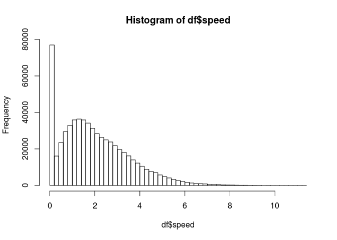
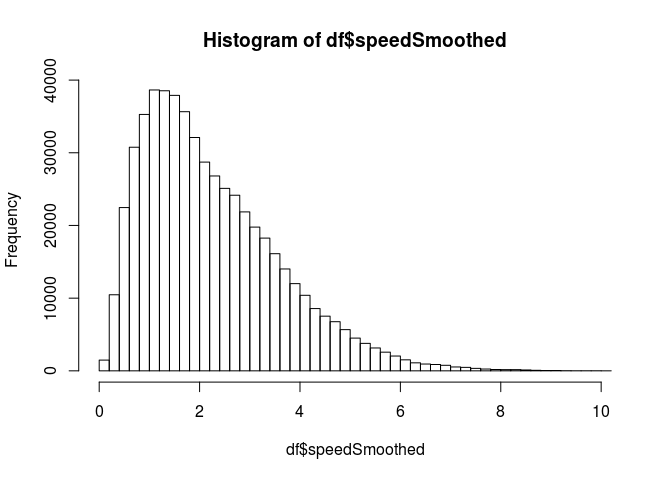
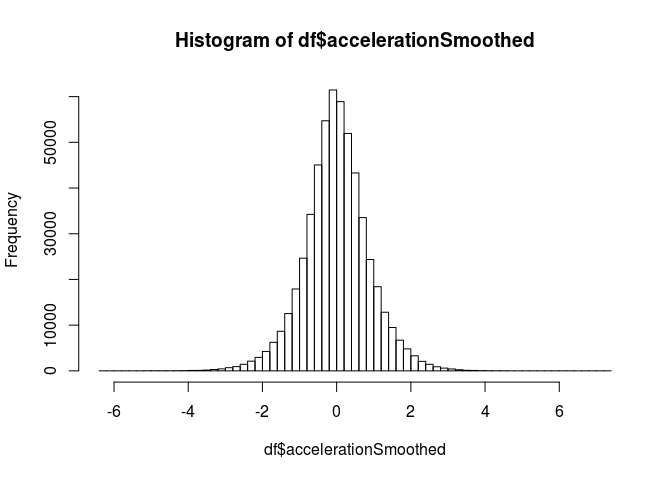

Calculating tracking metrics using ZXY data
================
Andreas K. Winther

Intro
-----

This markdown document shows how to calculate some basic tracking metrics using data published by Pettersen et al. (2014). A more indepth look into the following code, and the metrics themselves, will be part of a future blogpost on wintherperformance.com.

The following packages are required:

``` r
library(signal)
library(zoo)
library(dplyr)
library(ggplot2)
```

### Importing and changing column names

Import the dataset. Then change the names of the variables while adding a column with the time elapsed in seconds, and one in minutes. Next, use the x and y columns to calculate distance.

``` r
df <- read.csv("http://home.ifi.uio.no/paalh/dataset/alfheim/2013-11-03/zxy/2013-11-03_tromso_stromsgodset_first.csv", header = FALSE)

names(df) <- c("timestamp", "tag_id", "x_pos", "y_pos", "heading", "direction", "energy", "speed", "total_distance")

options(digits.secs = 6)
df$timestamp <- as.POSIXct(df$timestamp,format = "%Y-%m-%d %H:%M:%OS")
df$seconds <- as.numeric(df$timestamp - min(df$timestamp))
df$minutes <- df$seconds/60

df <- df %>%
  group_by(tag_id) %>%
  mutate(distance = (sqrt((x_pos - lag(x_pos))^2 + (y_pos - lag(y_pos))^2)))
```

### Filtering/smoothing

A lot of metrics are derivatives of either speed or velocity. It is therefore useful to check the data for noise and outliers. Examine the "speed" column by first plotting a histogram and then summarising the data:

``` r
hist(df$speed, breaks = 50)
```



``` r
summary(df$speed)
```

    ##    Min. 1st Qu.  Median    Mean 3rd Qu.    Max. 
    ##  0.0000  0.8618  1.7430  1.9902  2.9044 11.3117

The histogram shows a lot of outliers on the far left side, while the highest speed is recorded at 11.31 m/s or 40.7 km/h. This is highly unlikely, and should be closer to 10 m/s. Remove all values with "speed == 0", and then run the speed column through a low-pass filter as such:

``` r
df <- df[df$speed > 0,]

bf1 <- butter(1, 0.06, type = "low", plane = "z")
df <- df %>%
  group_by(tag_id) %>%
  mutate(speedSmoothed = signal::filter(bf1, speed))

summary(df$speedSmoothed)
```

    ##      Min.   1st Qu.    Median      Mean   3rd Qu.      Max. 
    ##  0.000438  1.195441  1.954186  2.245211  3.044485 10.004388

``` r
hist(df$speedSmoothed, breaks = 50)
```



### Total HI distance and total sprint distance

Now to calculate the total HI and sprint distance, do the following:

``` r
df <- df %>%
  group_by(tag_id) %>%
  mutate(hir_distance = (cumsum(ifelse(speedSmoothed >=5.5 & speedSmoothed <= 7, distance, 0))),
         sprint_distance = (cumsum(ifelse(speedSmoothed > 7, distance, 0))))

df %>%
  group_by(tag_id) %>%
  summarise(TotalDistance = max(total_distance),
            TotalHIRDistance = max(hir_distance),
            TotalSprintDistance = max(sprint_distance)) %>%
  dplyr::filter(!tag_id %in% c(3,6,11))
```

    ## # A tibble: 10 x 4
    ##    tag_id TotalDistance TotalHIRDistance TotalSprintDistance
    ##     <int>         <dbl>            <dbl>               <dbl>
    ##  1      1         5921.             495.              214.  
    ##  2      2         5849.             142.               35.9 
    ##  3      5         6658.             301.                8.80
    ##  4      7         6623.             371.              118.  
    ##  5      8         6068.             285.               66.9 
    ##  6      9         6046.             284.               91.9 
    ##  7     10         7177.             583.               99.6 
    ##  8     13         6318.             251.               57.3 
    ##  9     14         6693.             367.               54.6 
    ## 10     15         6449.             370.              204.

### Accelerations and decelerations

Next, to calculate accelerations and decelerations, do the following:

``` r
bf2 <- butter(1, 0.03, "low", "z")

df <- df %>%
  group_by(tag_id) %>%
  mutate(acceleration = c(NA, diff(speedSmoothed)) / c(NA, diff(timestamp)),
         accelerationSmoothed = c(NA, NA, signal::filter(bf2, acceleration)))

summary(df$accelerationSmoothed)
```

    ##      Min.   1st Qu.    Median      Mean   3rd Qu.      Max.      NA's 
    ## -6.252959 -0.503682 -0.008684  0.001346  0.508355  7.365544        26

``` r
hist(df$accelerationSmoothed, breaks = 50)
```



The number of sprints, accelerations and decelerations can then be extracted using the following function:

``` r
counter <- function(metric, threshold, timestamp, timeThreshold) {
  metricVector <- vector("numeric", length = length(metric))
  if (threshold > 0) {
    for (i in 1:length(metric)) {
    if (metric[i] > threshold) {
      metricVector[i] = 1
      } 
    } 
  }
  if (threshold < 0) {
    for (i in 1:length(metric)) {
    if (metric[i] < threshold) {
      metricVector[i] = 1
      } 
    } 
  }
  rleMetric <- rle(metricVector)
  indices <- cumsum(rleMetric$lengths)
  if (length(indices) %% 2 == 1) {
    indices <- c(indices, indices[length(indices)])
  }
  metricStart <- indices[seq(from = 1, to = length(indices), by = 2)]
  metricEnd <- indices[seq(from = 2, to = length(indices), by = 2)]
  metricStartStamp <- timestamp[metricStart]
  metricEndStamp <- timestamp[metricEnd]
  metricTimeDiff <- metricEndStamp - metricStartStamp
  return(sum(metricTimeDiff > timeThreshold))
}

df %>%
  group_by(tag_id) %>%
  summarise(accelerations = counter(na.omit(accelerationSmoothed), 2, timestamp, 0.5), 
            decelerations = counter(na.omit(accelerationSmoothed), -2, timestamp, 0.5),
            sprints = counter(speedSmoothed, 7, timestamp, 1)) %>%
  dplyr::filter(!tag_id %in% c(3,6,11))
```

    ## # A tibble: 10 x 4
    ##    tag_id accelerations decelerations sprints
    ##     <int>         <int>         <int>   <int>
    ##  1      1            33            45      11
    ##  2      2            30            30       3
    ##  3      5            31            37       1
    ##  4      7            48            36       7
    ##  5      8            42            32       3
    ##  6      9            44            30       7
    ##  7     10            50            57       5
    ##  8     13            46            46       3
    ##  9     14            44            32       2
    ## 10     15            46            46       8

### Work rate

Other common metrics such as sprint and acceleration distance, and sprint and acceleration workrate (distance per minutes), are derived as follows:

``` r
metricDistance <- function(metric, metricThreshold, timestamp, distance, timeThreshold) {
  metricVector <- vector("numeric", length = length(metric))
  if (metricThreshold > 0) {
  for (i in 1:length(metric)) {
    if (metric[i] > metricThreshold) {
      metricVector[i] = 1
      }
    }
  }  
  if (metricThreshold < 0) {
    for (i in 1:length(metric)) {
    if (metric[i] < metricThreshold) {
      metricVector[i] = 1
      } 
    } 
  }
  metricIndex <- rle(metricVector)
  metricIndexes <- cumsum(metricIndex$lengths)
  if (length(metricIndexes) %% 2 == 1) {
    metricIndexes <- c(metricIndexes, metricIndexes[length(metricIndexes)])
  }
  metricStart <- metricIndexes[seq(from = 1, to = length(metricIndexes), by = 2)]
  metricEnd <- metricIndexes[seq(from = 2, to = length(metricIndexes), by = 2)]
  metricStartStamp <- timestamp[metricStart] 
  metricEndStamp <- timestamp[metricEnd] 
  metricDistStartStamp <- distance[metricStart] 
  metricDistEndStamp <- distance[metricEnd] 
  metricTimeDiff <- metricEndStamp - metricStartStamp 
  metricDistDiff <- metricDistEndStamp - metricDistStartStamp 
  return(sum(metricDistDiff[metricTimeDiff >= timeThreshold])) 
}

df %>%
  group_by(tag_id) %>%
  summarise(accelDist = metricDistance(na.omit(accelerationSmoothed), 2, timestamp, total_distance, 0.5),
            decelDist = metricDistance(na.omit(accelerationSmoothed), -2, timestamp, total_distance, 0.5),
            sprintDist = metricDistance(speedSmoothed, 7, timestamp, total_distance, 1),
            workRateAccel = accelDist/max(minutes),
            workRateDecel = decelDist/max(minutes),
            workRateSprint = sprintDist/max(minutes),
            TotalDistance = max(total_distance),
            TotalHIRDistance = max(hir_distance),
            TotalSprintDistance = max(sprint_distance)) %>%
  dplyr::filter(!tag_id %in% c(3,6,11))
```

    ## # A tibble: 10 x 10
    ##    tag_id accelDist decelDist sprintDist workRateAccel workRateDecel
    ##     <int>     <dbl>     <dbl>      <dbl>         <dbl>         <dbl>
    ##  1      1      167.      79.2     169.            4.35         2.06 
    ##  2      2      125.      40.8      33.0           2.64         0.865
    ##  3      5      129.      44.2       8.80          2.73         0.936
    ##  4      7      225.      69.0     101.            4.77         1.46 
    ##  5      8      181.      48.4      49.6           3.84         1.03 
    ##  6      9      168.      47.1      82.7           3.57         0.997
    ##  7     10      227.      93.6      68.9           4.80         1.98 
    ##  8     13      207.      60.6      38.8           4.38         1.28 
    ##  9     14      196.      51.1      33.8           4.15         1.08 
    ## 10     15      220.      80.8     156.            4.67         1.71 
    ## # … with 4 more variables: workRateSprint <dbl>, TotalDistance <dbl>,
    ## #   TotalHIRDistance <dbl>, TotalSprintDistance <dbl>

### Number of sprints withing distance bands

The number sprints within certain distance bands can be extracted using the following function:

``` r
sprintDistance <- function(speed, speedThreshold, timestamp, distance, timeThreshold, meterStart, meterEnd) {
  sprintVector <- vector("numeric", length = length(speed))
  for (i in 1:length(speed)) {
    if (speed[i] > speedThreshold) {
      sprintVector[i] = 1
    }
  }
  sprintIndex <- rle(sprintVector)
  sprintIndexes <- cumsum(sprintIndex$lengths)
  if (length(sprintIndexes) %% 2 == 1) {
    sprintIndexes <- c(sprintIndexes, sprintIndexes[length(sprintIndexes)])
  }
  sprintStart <- sprintIndexes[seq(from = 1, to = length(sprintIndexes), by = 2)]
  sprintEnd <- sprintIndexes[seq(from = 2, to = length(sprintIndexes), by = 2)]
  sprintStartStamp <- timestamp[sprintStart] #Subsets timestamp indexes where a sprint starts
  sprintEndStamp <- timestamp[sprintEnd] #Subsets timestamp indexes where a sprint ends
  sprintDistStartStamp <- distance[sprintStart] #Subsets distance indexes where a sprint starts 
  sprintDistEndStamp <- distance[sprintEnd] #Subsets distance indexes where a sprint ends 
  sprintTimeDiff <- sprintEndStamp - sprintStartStamp #Calculates the time difference between sprint start and end
  sprintDistDiff <- sprintDistEndStamp - sprintDistStartStamp
  sprintDistDiff <- sprintDistDiff >= meterStart & sprintDistDiff <= meterEnd
  return(sum(sprintDistDiff[sprintTimeDiff > timeThreshold]))
}

df %>%
  group_by(tag_id) %>%
  summarise(sprintMeters1_5 = sprintDistance(speedSmoothed, 7, timestamp, total_distance, 0, 1, 5),
            sprintMeters6_10 = sprintDistance(speedSmoothed, 7, timestamp, total_distance, 0, 6, 10),
            sprintMeters11_15 = sprintDistance(speedSmoothed, 7, timestamp, total_distance, 0, 11, 15),
            sprintMeters16_20 = sprintDistance(speedSmoothed, 7, timestamp, total_distance, 0, 16, 20),
            sprintMeters21_25 = sprintDistance(speedSmoothed, 7, timestamp, total_distance, 0, 21, 25),
            sprintMeters26_30 = sprintDistance(speedSmoothed, 7, timestamp, total_distance, 0, 26, 30),
            sprintMeters31_35 = sprintDistance(speedSmoothed, 7, timestamp, total_distance, 0, 31, 35),
            sprintMeters36_40 = sprintDistance(speedSmoothed, 7, timestamp, total_distance, 0, 36, 40),
            sprintMeters41plus = sprintDistance(speedSmoothed, 7, timestamp, total_distance, 0, 41, 80)) %>%
  dplyr::filter(!tag_id %in% c(3,6,11))
```

    ## # A tibble: 10 x 10
    ##    tag_id sprintMeters1_5 sprintMeters6_10 sprintMeters11_…
    ##     <int>           <int>            <int>            <int>
    ##  1      1               5                6                2
    ##  2      2               1                1                1
    ##  3      5               0                1                0
    ##  4      7               1                6                2
    ##  5      8               2                1                1
    ##  6      9               4                3                2
    ##  7     10               3                3                0
    ##  8     13               0                4                1
    ##  9     14               1                5                1
    ## 10     15               7                1                1
    ## # … with 6 more variables: sprintMeters16_20 <int>,
    ## #   sprintMeters21_25 <int>, sprintMeters26_30 <int>,
    ## #   sprintMeters31_35 <int>, sprintMeters36_40 <int>,
    ## #   sprintMeters41plus <int>

### Metabolic power

Another interesting (but controversial) metric is metabolic power:

``` r
rad2deg <- function(rad) {(rad * 180) / (pi)}

bf3 <- butter(1, 0.01, "low", "z")

df <- df %>%
  group_by(tag_id) %>%
  mutate(alpha = rad2deg(atan(9.81/accelerationSmoothed)),
         g = sqrt(accelerationSmoothed^2 + 9.81^2),
         equivilantSlope = tan(0.5 * pi - atan(9.81/accelerationSmoothed)),
         equivilantMass = g/9.81,
         energyCost = ifelse(accelerationSmoothed == 0, 3.6*1.29, (155.4*equivilantSlope^5 - 30.4*equivilantSlope^4 - 43.3*equivilantSlope^3 + 46.3*equivilantSlope^2 + 19.5*equivilantSlope + 3.6)*equivilantMass*1.29),
         metabolicPower = energyCost*speedSmoothed,
         metabolicPowerSmoothed = c(NA, NA, NA, signal::filter(bf3, metabolicPower)))

df$metabolicPowerSmoothed[is.na(df$metabolicPowerSmoothed)] <- 0 

df <- df %>%
  group_by(tag_id) %>%
  mutate(HighPowerDistance = cumsum(ifelse(metabolicPowerSmoothed > 20 & metabolicPowerSmoothed < 35, distance, 0)),
         ElevatedPowerDistance = cumsum(ifelse(metabolicPowerSmoothed > 35 & metabolicPowerSmoothed < 55, distance, 0)),
         MaxPowerDistance = cumsum(ifelse(metabolicPowerSmoothed > 55, distance, 0)))
         


df %>%
  group_by(tag_id) %>%
  summarise(HighPowerDistance = max(HighPowerDistance),
            ElevatedPowerDistance = max(ElevatedPowerDistance),
            MaxPowerDistance = max(MaxPowerDistance)) %>%
  dplyr::filter(!tag_id %in% c(3,6,11))
```

    ## # A tibble: 10 x 4
    ##    tag_id HighPowerDistance ElevatedPowerDistance MaxPowerDistance
    ##     <int>             <dbl>                 <dbl>            <dbl>
    ##  1      1             1799.                  514.          103.   
    ##  2      2             1082.                  144.           29.7  
    ##  3      5             1682.                  233.            0.285
    ##  4      7             1489.                  383.           71.1  
    ##  5      8             1184.                  325.           36.5  
    ##  6      9             1377.                  231.           52.5  
    ##  7     10             2040.                  529.           59.2  
    ##  8     13             1318.                  284.           25.6  
    ##  9     14             1771.                  348.           27.1  
    ## 10     15             1200.                  445.          121.

References
----------

Pettersen, S. A., Johansen, D., Johansen, H., Berg-Johansen, V., Gaddam, V. R., Mortensen, A., … Halvorsen, P. (2014). Soccer video and player position dataset. *Proceedings of the 5th acm multimedia systems conference*, 18–23. ACM.
